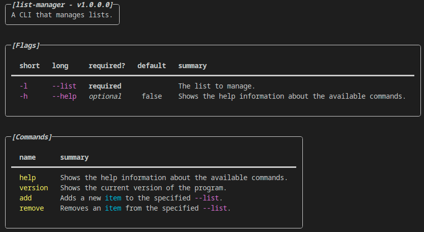
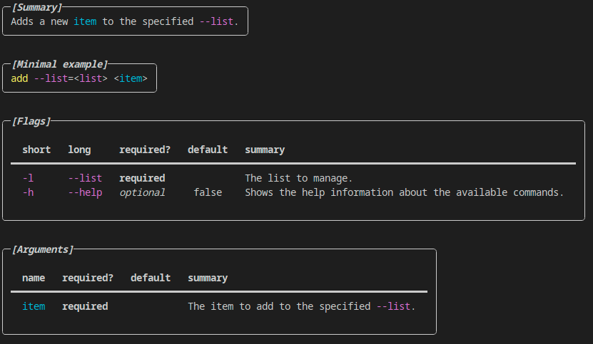

# OwlDomain.CommandLine

[](https://github.com/Owl-Domain/CommandLine/actions/workflows/build.yml)
[](https://github.com/Owl-Domain/CommandLine/actions/workflows/test.yml)

---

> [!IMPORTANT]
> This project will eventually be in-lined into the [`OwlDomain.Console`](https://github.com/Owl-Domain/Console) project *(which does not exist yet)*, so prepare for this project to eventually be deprecated.

This project focuses on experimenting with a "zero boilerplate" approach to making command line tools.

*(In reality it's a "zero or the minimal amount of necessary boilerplate" approach but that isn't quite as catchy).*

Which will result in regular C# code like this:

```cs
using OwlDomain.CommandLine.Engine;

namespace ListManager;

class Program
{
   static void Main(string[] args)
   {
      ICommandEngine engine = CommandEngine.New()
         .From<Commands>()
         .Build();

      engine.Run(args);

      // or
      engine.Repl();
   }
}

class Commands
{
   /// <summary>The list to manage.</summary>
   public required string List { get; init; }

   /// <summary>Adds a new <paramref name="item"/> to the specified <see cref="List"/>.</summary>
   /// <param name="item">The item to add to the specified <see cref="List"/>.</param>
   public void Add(string item)
   {
      /* implementation code */
   }

   /// <summary>Removes an <paramref name="item"/> from the specified <see cref="List"/>.</summary>
   /// <param name="item">The item to remove from the specified <see cref="List"/>.</param>
   public void Remove(string item)
   {
      /* implementation code */
   }
}
```

Turning into a CLI that looks a little like this:

__Output from `help`:__


__Output from `add --help`:__


*(The displayed colors will depend on the colors you have selected for your terminal).*

## Features

- Very customisable, almost every component can be fully replaced.
- Long and short flags.
- Required/optional flag and argument values.
- CLI and REPL modes.
- Customisable "dependency injection" like feature.
- Virtual flags and commands, ie. `help` and `version`.
- Co-operative cancellation support.
- Support for return values.


## Usage

Using this library is quite simple, all you have to do is reference the main package
`OwlDomain.CommandLine`, and then just like the main example shows, create a new instance
of the `ICommandEngineBuilder` by doing `CommandEngine.New()`, ie:

```cs
using OwlDomain.CommandLine.Engine;

ICommandEngineBuilder builder = CommandEngine.New();
```

This builder will let you customise a lot of different things *(read the [customisation](./docs/customisation.md) document for more information on this).*

The only thing that you are required to do is register a class which contains the commands that you want to make available, you can do this through one of two ways:

```cs
builder.From(typeof(MyCommands));

// or
builder.From<MyCommands>();

class MyCommands
{
   /* Your command implementations go here */
}
```

> [!WARNING]
> Currently you are required to register one *(and only one)* class for your commands.

After this, you simply build the engine with the `Build()` command, and then choose between either the CLI mode, or the REPL mode like so:

```cs
ICommandEngine engine = builder.Build();

// CLI mode, args is the args from the Main(string[] args) function.
engine.Run(args);

// or REPL mode, where several commands can be executed one by one.
engine.Repl();
```

Defining your commands and flags should feel quite natural, each property
is a flag, and each method is a command, you can mark a flag as required by using C#'s
`required` keyword, and you can set a default argument/flag just as naturally, ie:

```cs
class MyCommands
{
   public required string RequiredFlag { get; init; }
   public int OptionalFlag { get; init; } = 5;

   public void Command(string requiredArgument, string optionalArgument = "default-value")
   {
      /* implementation here */
   }
}
```

> [!WARNING]
> Currently, the default implementation for the name extractor only supports `camelCasing`
> and `PascalCasing` for the properties, parameters and methods.


## Contributions

Code contributions will not be accepted, however feel free to provide feedback / suggestions
by creating a [new issue](https://github.com/Owl-Domain/CommandLine/issues/new), or look at
the [existing issues](https://github.com/Owl-Domain/CommandLine/issues?q=) to see if your
concern / suggestion has already been raised.


## License

This project (the source, the release files, e.t.c) is released under the
[OwlDomain License](https://github.com/Owl-Domain/CommandLine/blob/master/license.md).
